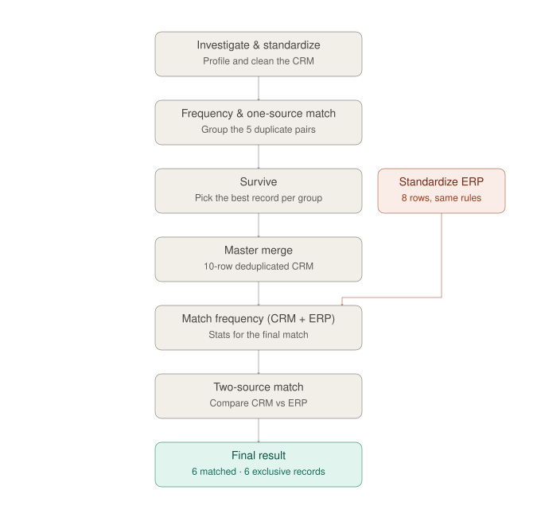

# IBM DataStage QualityStage End-to-End Demo

A comprehensive, production-validated demonstration showcasing **all major QualityStage stages** within IBM DataStage (Cloud Pak for Data / watsonx.data integration), using a realistic business scenario: **cleansing, standardizing, and deduplicating a customer master**, followed by a **cross-system match against an ERP system** to identify overlaps.

> **Project Status: COMPLETE AND VALIDATED.** All 6 stages have been validated end-to-end on a real instance, culminating in the final Two-Source Match: **6 customers exist in both systems, 2 are ERP-exclusive, 4 are CRM-exclusive**. **30 real-world issues** were resolved during implementation — all documented in `docs/07-troubleshooting.md`.

## Pipeline Overview

## Repository Contents

| Directory | Contents |
|-----------|----------|
| `/data` | Source CSV files (dirty CRM + ERP master reference) used throughout the demo |
| `/specs` | Stage specifications: Standardize rules (real `MXADDR`/`MXNAME`/`MXAREA` rule sets), Match Specification definitions, weights, frequency information |
| `/docs` | Detailed step-by-step guide, including real troubleshooting log (`07-troubleshooting.md`) |
| `/outputs` | Real reports and outputs generated from running jobs on a production instance (`investigate_reports/`: Step 1; `standardize_reports/`: Step 2; `onesource_match_reports/`: Steps 3-4; `survive_reports/`: Step 5; `master_clean_reports/`: final cleaned master of 10 records; `erp_standardize_reports/`: standardized ERP, 8 records; `match_frequency_twosource_reports/`: independent CRM and ERP frequencies, Step 6 preparation; `twosource_match_reports/`: final Step 6 results — matched, clerical, nonmatched by source, statistics) |
| `/images` | `pipeline-overview.svg` — summary diagram of the 9 jobs (CRM track, ERP track, final result) |
| `/platform-export` | Real project export from Cloud Pak for Data — all 9 jobs, ready to import into your own instance. See `platform-export/README.md` |

## Prerequisites

- Access to **IBM Cloud Pak for Data / watsonx.data integration** with the **DataStage** module and **QualityStage** functionality enabled (Data Quality group in the stage palette)
- Domain standardization rules (rule sets): `USNAME`, `USADDR` (or regional rule sets for Mexico if your installation includes them) — alternative approaches explained in `docs/02-standardize.md`

## Getting Started

Two approaches, depending on your learning objectives:

### A. Build from Scratch (Recommended for Learning)
1. Clone this repository
2. Upload CSV files from `/data` as source connectors/files in your DataStage project
3. Follow `docs/00-step-by-step-guide.md` in sequence — each chapter corresponds to a stage and links to its specification file in `/specs`
4. Upon completion, compare your results against `data/expected_output_notes.md`

### B. Import and Explore the Complete Project
1. Clone this repository
2. Import `/platform-export` into your own instance (`Manage project > Import project`)
3. Upload CSV files from `/data` as data assets (the export references them but doesn't embed them)
4. Run the 9 jobs in sequence and compare against `/outputs` and `data/expected_output_notes.md`

See `platform-export/README.md` for complete details on Option B.

## QualityStage Stages Covered

- ✅ Investigate (character discrete + word investigation)
- ✅ Standardize
- ✅ Match Frequency
- ✅ One-Source Match (deduplication / unduplicate match)
- ✅ Survive
- ✅ Two-Source Match (reference match against ERP)

## Related Article

This repository accompanies a narrative article published on Medium: **"[A Walkthrough of IBM QualityStage: From a Messy CRM to a Validated Cross-System Match](https://www.linkedin.com/in/jcgarciahdz/)"**.

## Technical Highlights

- **Real-world validation**: All 30 issues encountered during development are documented with root causes and solutions
- **Production-ready patterns**: Demonstrates proper handling of data type conversions, schema propagation, and stage configuration
- **Regional rule sets**: Uses Mexico-specific standardization rules (`MXNAME`, `MXADDR`, `MXAREA`)
- **Complete traceability**: Every output file is included for validation and comparison

## Author

**Julio César García Hernández**

Client Value Engineer (Data & Business Automation) | AI | Data Integration | Business Automation | IBM Technology

## License

MIT License — feel free to reuse and adapt with proper attribution.

---

## Quick Links

- [Step-by-Step Guide](docs/00-step-by-step-guide.md)
- [Troubleshooting Log](docs/07-troubleshooting.md)
- [Expected Results](data/expected_output_notes.md)
- [Platform Export Guide](platform-export/README.md)

## Contributing

Contributions, issues, and feature requests are welcome. Feel free to check the [issues page](../../issues) if you want to contribute.

## Acknowledgments

This project was developed and validated on IBM Cloud Pak for Data with DataStage and QualityStage modules. Special thanks to the IBM Data Integration community for their support and documentation.